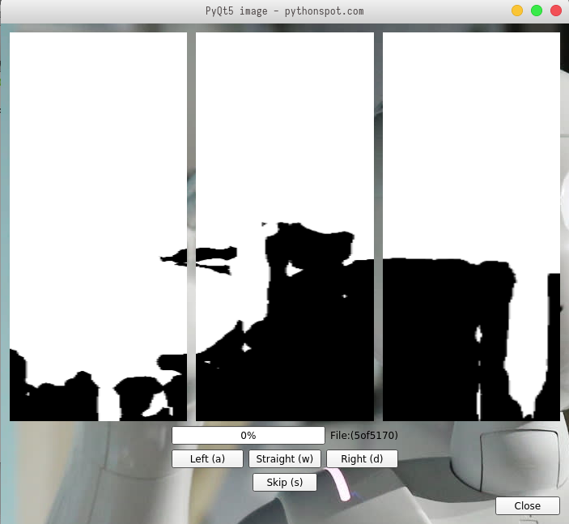

# AnnotationApp
## Annotation tool for Master Thesis project
## Project: Indoor Navigation using Computer Vision and Deep Learning on RGB Images

Annotation tool for classifying semantically segmented images into the Left, Right and Straight categories. The tool requires images on which semantic segmentation has already been performed (find in './SEG_final_rename'). The image classes are saved in appropriate folder in './SEG_cleaned'. 

Requirements:
- Python 3.6+
- PyQt5
- OpenCV
- pickle

Run: python annotate.py

W-A-D keys for straight, left and right respectively, and S for skipping image (in case of badly segmented image)

